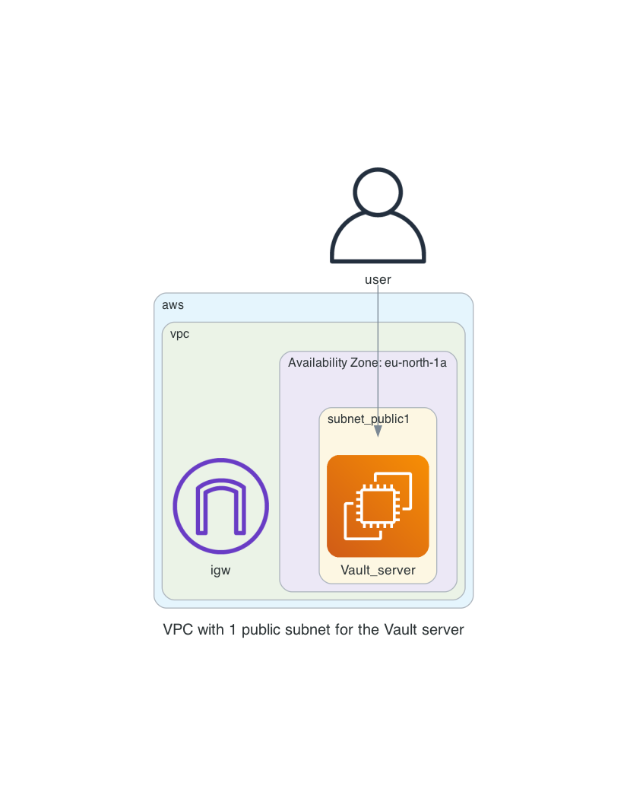

# Vault server standalone

This repository will create a standalone Vault server latest version with public access to use for your own personal testing

# Creating the infrastructure

We create the infrastructure according to the following diagram for the
  

# Prerequisites
## AWS
We will be using AWS. Make sure you have the following

AWS account

## Vault installation
Make sure you have the Vault tool installed locally with the help of the following documentation found [here](https://developer.hashicorp.com/vault/downloads)

# How to

- Clone this repository
```
git clone https://github.com/munnep/vault_aws_standalone.git
```
- Set your AWS credentials
```
export AWS_ACCESS_KEY_ID=
export AWS_SECRET_ACCESS_KEY=
export AWS_SESSION_TOKEN=
```
- Go into the directory `vault_aws_standalone`
```
cd vault_aws_standalone
```
- Create a file called `variables.auto.tfvars` with the following contents
```
tag_prefix               = "vault1"                         # TAG prefix for names to easily find your AWS resources
region                   = "eu-north-1"                     # Region to create the environment
vpc_cidr                 = "10.234.0.0/16"                  # subnet mask that can be used 
dns_hostname             = "vault1"                         # DNS hostname for the TFE
dns_zonename             = "aws.munnep.com"                 # DNS zone name to be used
certificate_email        = "patrick.munne@hashicorp.com"    # Your email address used by TLS certificate registration
public_key               = "ssh-rsa AAAAB3Nza"              # The public key for you to connect to the server over SSH
```
- Initialize terraform
```
terraform init
```
- Create the AWS resources
```
terraform apply
```
- The output should be the following
```
ssh_vault_server = "ssh ubuntu@vault1.aws.munnep.com"
tfe_ip = "13.49.110.167"
vault_address = "export VAULT_ADDR='https://vault1.aws.munnep.com:8200'"
vault_dashboard = "https://vault1.aws.munnep.com:8200"
```
- set the VAULT_ADDR environment variable
```
export VAULT_ADDR='https://vault1.aws.munnep.com:8200'
```
- Initialise the new Vault server
```
 vault operator init
```
- Save the output
``` 
Unseal Key 1: H0aoL1jfJIiq+vtY8H1YjGxNfZk2HZoJJd2hyAXLlUpk
Unseal Key 2: QefLAloJT3uRIXGuc6QIqmZiB/mauapUxI+aHJO3ZFyA
Unseal Key 3: 7K40XFnpODnt/eQRrUMWJeecnbQU00u8LwCcBCSlebQr
Unseal Key 4: v8juOGgTLV1MRzkw9aWhOCaT7DVOJ8viXwnYs2Q05dgF
Unseal Key 5: 0LyH1Pur+PtXm0auF879ggaTwaVV2ux1dR2Ek4DxooB5

Initial Root Token: hvs.oH3RBWPIeF35voZkAo3l5kty

Vault initialized with 5 key shares and a key threshold of 3. Please securely
distribute the key shares printed above. When the Vault is re-sealed,
restarted, or stopped, you must supply at least 3 of these keys to unseal it
before it can start servicing requests.

Vault does not store the generated root key. Without at least 3 keys to
reconstruct the root key, Vault will remain permanently sealed!

It is possible to generate new unseal keys, provided you have a quorum of
existing unseal keys shares. See "vault operator rekey" for more information.
```
- Unseal the vault environment for usage. 3 times with different unseal keys
```
 vault operator unseal
```
- Now check the status
```
vault status

Key                     Value
---                     -----
Seal Type               shamir
Initialized             true
Sealed                  false
Total Shares            5
Threshold               3
Version                 1.14.1
Build Date              2023-07-21T10:15:14Z
Storage Type            raft
Cluster Name            vault-cluster-b133e1ab
Cluster ID              0b44fb1b-d19a-99b5-244b-0c8439356866
HA Enabled              true
HA Cluster              https://vault1.aws.munnep.com:8201
HA Mode                 active
Active Since            2023-08-27T17:58:56.702519083Z
Raft Committed Index    34
Raft Applied Index      34
```
- Now you can login using your token
```
vault login

Success! You are now authenticated. The token information displayed below
is already stored in the token helper. You do NOT need to run "vault login"
again. Future Vault requests will automatically use this token.
```

